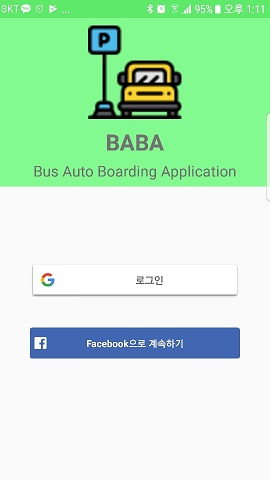

# 비콘을 이용한 버스 자동 승하차 시스템
프로젝트 소개 목적으로 작성된 페이지입니다.  
 

## 프로젝트 소개
+ 졸업과제로 자동 승하차 시스템을 구현함으로써, 승하차 시간을 줄이고, 하차 미태그 문제를 해결하기 위한 프로젝트입니다.  
+ 초 전력 블루투스인 Beacon들을 활용해 삼변측량을 통해 상대좌표를 알아내고, 칼만필터링으로 오차를 줄여 탑승 여부를 판단하여 결과값을 서버로 전송하는 형태의 프로젝트입니다.

## 본인 역할
전 크게 두가지 역할을 맡았습니다.  
+ 앱 백엔드 부분(상대좌표 파악, 승하차 여부, 결과값 전송),  
+ 서버 부분(AWS에서의 웹서버, 우분투os, Apache, MVC+DAO 패턴의 JSP+Servlet+MySQL)  

당시에 서버에 대한 이해도가 부족한 상태여서 수업시간에 배운 웹서버를 활용하는 방식으로 구현했습니다.  
인스턴스가 삭제되어 버려서 현재는 앱에 대한 코드만 남아있습니다.  
BABABA/app/src/main/java/com/example/lee/bababa/   에서 View 파트를 제외한 나머지를 코딩했습니다.
## 개발환경
+ 앱은 **안드로이드 스튜디오** 에서 개발했고, 프론트/백 엔드를 따로 분리해 개발했고 개발 후, 합치는 방식으로 진행했습니다.
+ 서버는 윈도우 환경에서 **이클립스** 에서 개발 후, 푸티와 파일질라를 이용해 배포했고, 아파치를 사용했습니다.

 ### 설계 구상도

  
  
### 앱 동작 화면

  

  

### 당시 계획된 usecase 다이어그램

