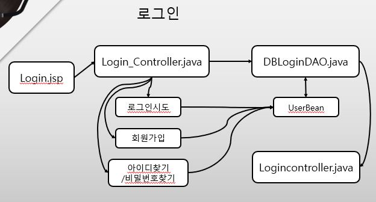
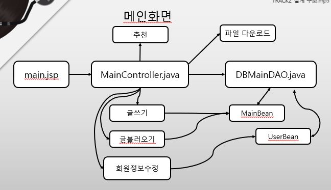
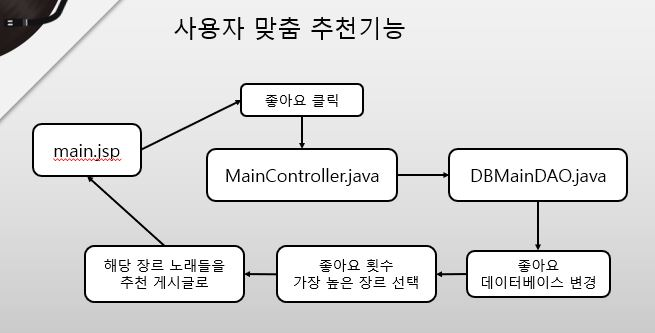

# 웹 서비스 프로젝트 음악공유 SNS
프로젝트 소개 목적으로 작성된 페이지입니다.  
 

## 프로젝트 소개
+ 음악 업로드, 공유를 대상으로 한 SNS를 수업을 통해 배운 JSP+Servlet+MySQL를 사용해 MVC+DAO패턴으로 개발하고자 했습니다.  
+ 개인의 성향에 따른 추천도 구현하려했고, 클릭한 특정한 장르의 수가 높은 순서대로 해당 장르의 노래가 상단에 배치되는 식으로 개발했습니다.
+ 로그인, 정보수정, 삭제, 다운로드, 업로드, 글쓰기, 좋아요에 대한 기본적인 기능을 구현했습니다.
+ 웹서버의 기본적인 이해를 위한 프로젝트였습니다.

## 본인 역할
+ View에서 오는 요청에 따라 데이터를 SQL과 주고받는 Controller부분의 Servlet (백엔드 담당)
+ View의 50프로 정도(로그인, 회원가입, 그리고 결과에 따른 창 출력.. 메인화면 제외한 대부분의 화면 구현)  
  
src/ 경로에 있는 3가지의 컨트롤러와 web/login/ 경로의 파일들이 제가 맡은 부분입니다.  
여러모로 아쉬움이 많은 프로젝트였습니다. 웹에 대한 이해도가 상당히 부족하여 쓸만한 좋은 기술이 많음에도 불구하고  
디자인이나 서버 코딩에 있어 많이 서툴렀던 프로젝트입니다.  
주로 백엔드를 담당했고, JSP, Servlet 등을 배운 수업의 프로젝트로써 개발했습니다.

## 개발환경
+ **이클립스** 에서 **Apache** 를 연동해 활용하는 방식으로 개발했고, View, Controller, Model로 따로 분류해 파트를 지정한 후 개발했습니다.

 ### 설계 구상도

  
  
### 웹 동작 화면

*더 이상 사용하지 않는 저장소 입니다.*