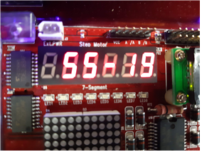
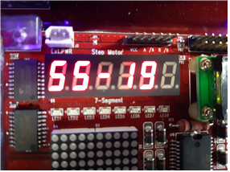
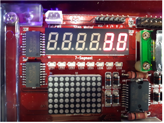

# 임베디드 시스템 프로젝트
프로젝트 소개 목적으로 작성된 페이지입니다.  
 

## 프로젝트 소개
+ 기기의 드라이버 프로그래밍을 통해 임베디드 시스템과 임베디드 프로그래밍에 익숙해지기 위한 프로젝트입니다.
+ buzzer, 7-segments의 드라이버 개발을 통해 원하는대로 출력이 가능하게 만들었습니다.

원래 7-segments 같은 경우에는 숫자밖에 출력이 안되지만, 직접 드라이버 수정을 통해 직사각형, 뺼셈, 오류, 정답과 같은 의도적인 
출력을 만들었습니다. buzer또한 오답과 정답시의 출력을 다르게 하는 프로젝트였습니다.  
  
embedded.pdf가 최종 보고서입니다.
## 본인 역할
기기 화면에 나오는 애플리케이션을 제외한 거의 모든 부분을 개발했습니다. 
+ 기기의 드라이버 개발을 통해 buzzer신호와 7-segments에 기존에는 없는 형태의 출력을 만들었습니다.  
+ JNI 프로그래밍을 통해 Java기반의 이클립스와 C기반의 기기와의 소통이 가능하게 만들었습니다.

window환경에서 JNI파일을 개발했고, 리눅스 환경에서 기기의 드라이버를 개발했습니다. 앱을 기기에 올려 드라이버를 통한 기기의 출력이 제대로 되는지 확인하는 식으로 개발했습니다.
## 개발환경
+ 임베디드 프로그래밍 목적으로 만들어진 기기를 사용했습니다. (hbe sm3 sv210)
+ 이클립스에 안드로이드 개발 라이브러리를 설치해 앱개발을 했습니다.
+ 리눅스 환경에서 C언어로 드라이버 프로그래밍을 했습니다.

드라이버 : /Android/drivers/...
JNI : /Android/android-ndk-r5b/apps/ESTermProject/project/jni/...
(JNI폴더중 Application.mk는 /Android/android-ndk-r5b/apps/ESTermProject 경로)

 ### 기기 화면
#### 오답 또는 정답이 출력되기 전 화면

#### 오답일 때

  
왼쪽으로 한간씩 이동하면서 문제를 다시 출력한다.
  
#### 정답일 때
  
오답과 마찬가지로 한칸씩 이동한다.

더 자세한 화면과 내용은 embedded.pdf 파일에 있습니다.

